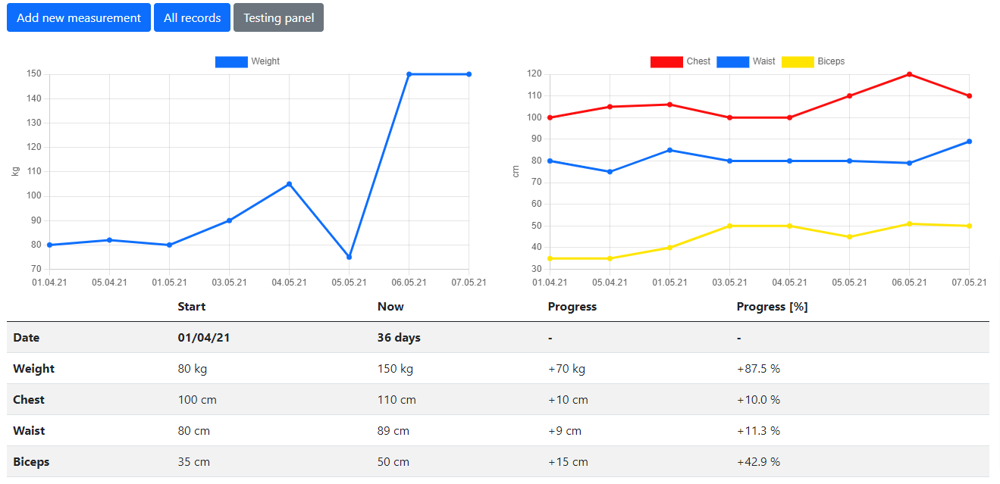
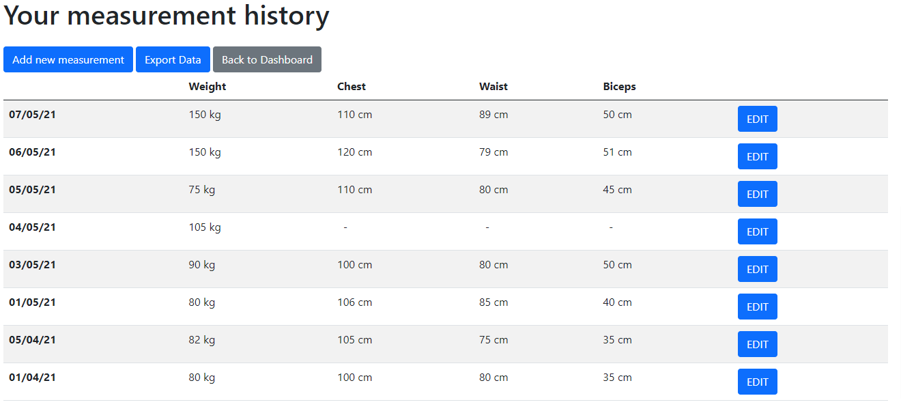

# Body Size Tracker
> Portal where you can keep track of your body measurements.
> Live demo [_here_](https://body-tracker.onrender.com/). 

## Table of Contents
* [General Features](#general-information)
* [Technologies Used](#technologies-used)
* [Screenshots](#screenshots)
* [Project Status](#project-status)
* [Contact](#contact)

## General Features
- User Authentication
- Storing measurements in database
- Dashboard with interactive charts and progress information
- Exporting measurements history to CSV/PDF file
- Interactive Charts
- BMI Calculator

## Technologies Used
- Python - version 3.8
- Django - version 3.2

## Screenshots

## Project Status
Project is: _no longer being worked on_.

## Contact
Created by [@Bartosz Kowalik](https://www.linkedin.com/in/bartosz-kowalik-dev/) - feel free to contact me! 
